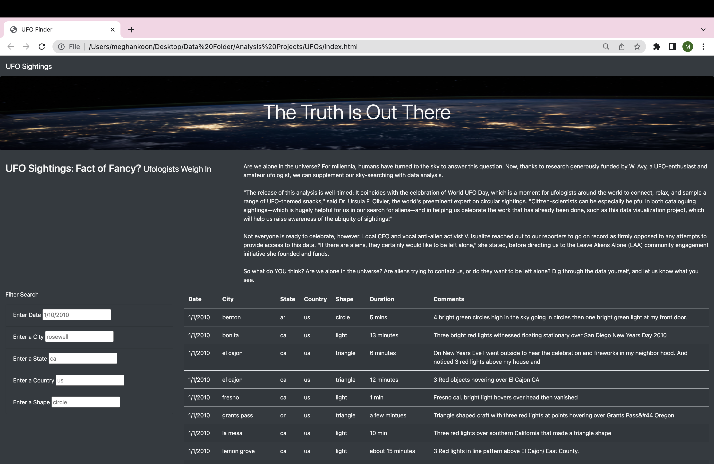
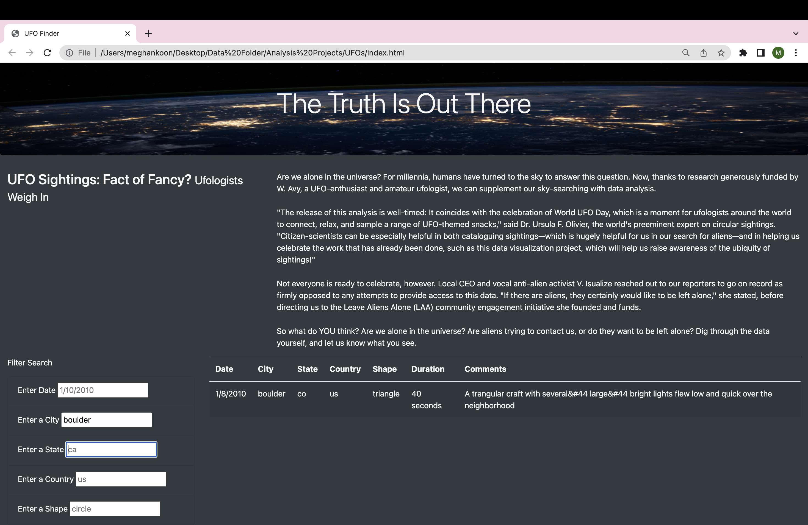
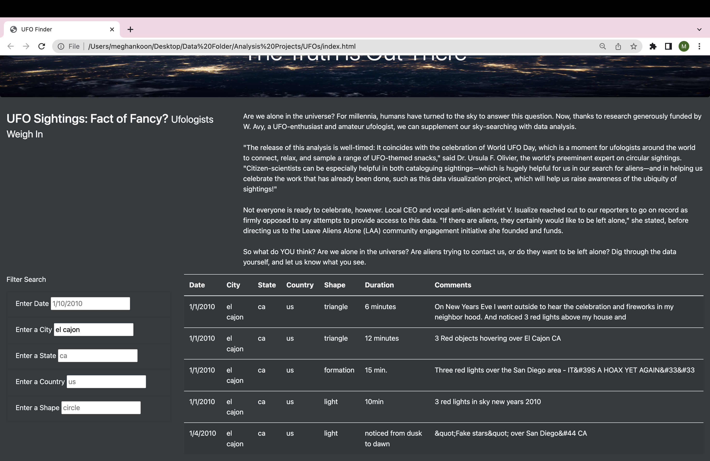

# UFO Sightings with JavaScript 
## Overview 
***Background***
Specifically, we helped Dana create a webpage about UFO Sightings using JavaScript to build a table using data stored in a JavaScript array. Throughout the process, we learned about JavaScript, HTML, and CSS. We specifically learned how to:

- Explain the strengths and weaknesses of JavaScript "standard" and JavaScript version ES6+.
- Describe JavaScript syntax and ideal use cases.
- Build and deploy JavaScript functions, including built-in functions.
- Convert JavaScript functions to arrow functions.
- Build and deploy forEach (JavaScript for loop).
- Create, populate, and dynamically filter a table using JavaScript and HTML

***Purpose***
The purpose of this challenge assignment is to help Dana's webpage and dynamic table to provide a more in-depth analysis of UFO sightings by allowing users to filter for multiple criteria at the same time. Instead of filtering by just the date, we are to create filters that work for city, state, country and shape as well.

## Resources 
- Original Data Source: [data.js](https://github.com/meghanhkoon/UFOs/blob/main/static/js/data.js)
- Software: JavaScript, Bootstrap, HTML, and CSS

## Results
The webpage UFO Sightings: The Truth Is Out There uses HTML and JavaScript to perform a dynamic table for the audience to search through different filters to find data on specific UFO Sightings. The webpage also includes a summary of the topic, a dynamic table to display information from the original dataset, and search filters that allow readers to update the table based on the filters (date, city, state, country and shape). See a snapshot of our webpage below: 

### How to perform a search

To perform a search, readers can Filter Search (bottom left corner of the screenshot above). Instead of filtering by just date, we added City, State, Country and Shape filters for our readers to get more specific data for their searches. You do not need to use all the filters. However, you must use at least one of the filters to narrow your search. 

For example, if you wanted to find a UFO Sighting in the city of Boulder. You would type "boulder" into the Enter a City textbox. See the image below. Notice how the data changed to display only one result in our table. 

## Summary 
### Drawbacks 
Although the layout and dynamic table filters through the UFO Sighting data correctly, there are a few drawbacks:

- There is no button to click once the filtered searches are filled in.
- The placeholder text does not clear once you click in the textbox. 
- The search filters are case sensitive and only recognize all lowercase words. For example, if you type in "El Cajon" instead of "el cajon," you won't have any results. See the images below. The first shows a search for "El Cajon" that has zero results. The second image shows the search results for "el cajon" with a total of 5 sightings in the table. 

***City Search: El Cajon (0 results)***

***City Search: el cajon (5 results)***

### Recommendations
After analyzing the functions of the interactive website ***UFO Sightings***, the following are recommendations for further development:
- Additional events could be added to enhance user experience. Some examples include: button to click after filters are added and a dropdown list for each filter search (to help guide user to know what is available).
- From the drawbacks listed earlier, creating a function to clear the placeholder text once a user enters some information in the filters would make it less confusing as to what they were searching for. 
- To make the search filters less strict and include all cases for words (not just lower case). 
- Lastly, it would be great to have additional data that is continuously being pulled from the internet to update the data source. 
